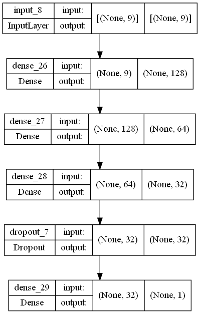
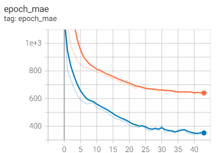
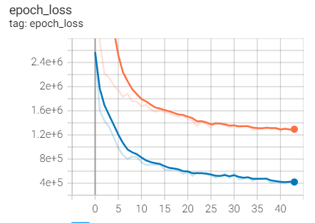
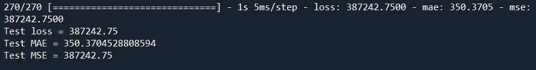
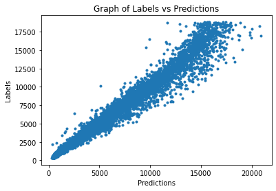

# Diamond Price Prediction Using Feedforward Neural Network

## 1. Summary
The aim of this project is to predict the price of diamond based on the features(carat, cut, color, clarity, depth, table, and dimensions).

## 2. Methodology
### 2.1 IDE and Frameworks
This project was created using Spyder as the IDE. The frameworks used include Tensorflow Keras and Scikit-learn. Libraries such as numpy and pandas are also used in this project.

### 2.2 Data Source
The data used in this project is obtained from [Diamonds](https://www.kaggle.com/datasets/shivam2503/diamonds).

########
### 2.3 Data Pipeline
The data is first loaded and preprocessed to remove columns that are not useful. Ordinal encoder is used to encode the categorical features. The data is then split into train-validation-test sets, where 20% of the data is allocated to the validation set, and the remaining data is split into train and test sets in a ratio of 60:40.

### 2.4 Model Pipeline
A feedforward neural network is constructed to solve the regression problem. The structure of the model constructed is shown in the figure below.

The model is trained with a batch size of 64 and 100 epochs. Early stopping is applied to the training, where it stops at epoch 43. The training process is shown in the figures below. A training MAE of 647 and validation MAE of 349 is obtained.

  

## 3. Results
The model is then evaluated using the test data prepared. The results obtained from the evaluation is shown in the figure below.

The test data is also used to make predictions of the diamond price. A graph of Labels against Predictions is plotted, as shown below.

Based on the graph, a linear trend can be observed, indicating that the predictions are similar to the results obtained.
